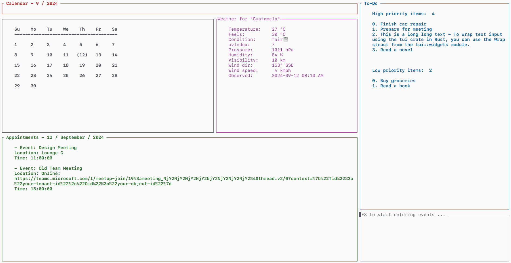

# RustyTUICalendar

RustyTUICalendar is a terminal-based calendar application written in Rust. It leverages the `chrono` crate for date and time manipulation and provides a simple and intuitive interface for viewing and managing calendar events.



## Features

- Display a monthly calendar starting from Sunday
- Add and delete events
- Highlight current date
- Add and delete To-Do list
- User-friendly terminal interface
- View current weather data

## Installation

To install RustyTUICalendar, you need to have Rust and Cargo installed on your system. You can install Rust by following the instructions on the official Rust website.

Clone the repository:

```sh
$ git clone https://github.com/soumyasen1809/RustyTUICalendar.git
$ cd RustyTUICalendar
```

Build the project:

```sh
$ cargo build --release
```

Run the application:

```sh
$ cargo run
```

## Features
Press F3 to start typing your commands.

- **Add Events to ToDo or Calendar**: If the input specifies `todo`, it adds the event to the ToDo list. If the input specifies `app`, it adds the appointment to the calendar.
```sh
$ app, 2024-09-14 13:14:50, Appointment Title, Appointment Location
$ todo, true, Todo Title
```
- **Search for an Appointment**: If the input specifies `search`, it searches for the appointment in the calendar for the given date.
```sh
$ find, 2024-09-14
```
- **Jump to Today**: If the input specifies `today`, it sets the calendar date to the current date.
```sh
$ today
```

The default location for Weather is set as Guatemala. If you want to add your city of choice, replace it to the city you want. If you want to get the weather conditions for your current location, leave the string empty.

Additionally, press F1 and F2 to move to previous and next months respectively.

## Contributing

Contributions are welcome! If you have any ideas, suggestions, or bug reports, please open an issue or submit a pull request.

## License

This project is licensed under the MIT License. See the LICENSE file for details.

## Acknowledgements

- chrono crate for date and time manipulation
- ratatui crate for terminal user interface
- wttr.in for weather data

## Contact

For any questions or inquiries, please contact the author.
